# Introduccíon a Git y GitHub

## 🧠 Control de Versiones

El **control de versiones (VCS, Version Control System)** es la práctica de **rastrear, registrar y gestionar cambios** en archivos o proyectos a lo largo del tiempo.

Permite mantener un historial completo, revertir versiones anteriores y facilitar la colaboración en equipo.

---

## ⚙️ Git

**Git** es un sistema de control de versiones distribuido (DVCS).

Cada copia del repositorio contiene todo el historial del proyecto, lo que permite trabajar de forma local y sin conexión.

Git rastrea los cambios en archivos mediante un conjunto de comandos que administran el flujo desde la creación hasta la publicación de versiones.

---

## ☁️ GitHub

**GitHub** es una plataforma en línea que **aloja repositorios Git** y permite la colaboración remota, revisión de código, control de versiones compartido y exposición de proyectos (portafolio).

Proporciona herramientas de automatización, control de acceso, integración continua (CI/CD) y documentación colaborativa.

---

## 📁 Conceptos Clave

| Concepto | Descripción |
| --- | --- |
| **Repositorio** | Estructura donde Git almacena todos los archivos y su historial de cambios. |
| **Repositorio local** | Versión del repositorio que reside en el sistema del usuario. |
| **Repositorio remoto** | Versión del repositorio alojada en un servidor (por ejemplo, GitHub). |
| **Commit** | Instantánea del proyecto en un punto determinado del tiempo. |
| **Área de preparación (Staging area)** | Zona intermedia donde se seleccionan los cambios que serán incluidos en el próximo commit. |
| **Branch (Rama)** | Línea de desarrollo independiente dentro del mismo repositorio. |
| **Merge** | Integración de cambios desde una rama hacia otra. |
| **Clone** | Copia local de un repositorio remoto. |
| **Push/Pull** | Operaciones para enviar o recibir cambios entre repositorios locales y remotos. |
| **HEAD** | Referencia al commit actual en el que se encuentra el repositorio. |

---

# Introducción a Git y GitHub

## 🧠 Control de Versiones

El **control de versiones (VCS, Version Control System)** es la práctica de **rastrear, registrar y gestionar cambios** en archivos o proyectos a lo largo del tiempo.

Permite mantener un historial completo, revertir versiones anteriores y facilitar la colaboración en equipo.

---

## ⚙️ Git

**Git** es un sistema de control de versiones distribuido (DVCS).

Cada copia del repositorio contiene todo el historial del proyecto, lo que permite trabajar de forma local y sin conexión.

Git rastrea los cambios en archivos mediante un conjunto de comandos que administran el flujo desde la creación hasta la publicación de versiones.

---

## ☁️ GitHub

**GitHub** es una plataforma en línea que **aloja repositorios Git** y permite la colaboración remota, revisión de código, control de versiones compartido y exposición de proyectos (portafolio).

Proporciona herramientas de automatización, control de acceso, integración continua (CI/CD) y documentación colaborativa.

---

## 📁 Conceptos Clave

| Concepto | Descripción |
| --- | --- |
| **Repositorio** | Estructura donde Git almacena todos los archivos y su historial de cambios. |
| **Repositorio local** | Versión del repositorio que reside en el sistema del usuario. |
| **Repositorio remoto** | Versión del repositorio alojada en un servidor (por ejemplo, GitHub). |
| **Commit** | Instantánea del proyecto en un punto determinado del tiempo. |
| **Área de preparación (Staging area)** | Zona intermedia donde se seleccionan los cambios que serán incluidos en el próximo commit. |
| **Branch (Rama)** | Línea de desarrollo independiente dentro del mismo repositorio. |
| **Merge** | Integración de cambios desde una rama hacia otra. |
| **Clone** | Copia local de un repositorio remoto. |
| **Push/Pull** | Operaciones para enviar o recibir cambios entre repositorios locales y remotos. |
| **HEAD** | Referencia al commit actual en el que se encuentra el repositorio. |

---

## 💻 Comandos Esenciales de Git

| Comando | Descripción | Uso común |
| --- | --- | --- |
| `git config --global user.name "Nombre"` | Configura el nombre del usuario global para los commits. | Identificación de usuario |
| `git config --global user.email "correo@ejemplo.com"` | Configura el correo electrónico asociado a los commits. | Identificación de usuario |
| `git init` | Inicializa un nuevo repositorio Git en el directorio actual. | Crear repositorio local |
| `git clone htts://www.github....` | Clona un repositorio remoto existente. | Descargar repositorio |
| `git status` | Muestra el estado de los archivos en el repositorio (rastreados, no rastreados, modificados). | Ver estado actual |
| `git add <archivo>` | Agrega archivos al área de preparación. | Preparar cambios |
| `git add .` | Agrega todos los archivos modificados al área de preparación. | Preparar todos los cambios |
| `git commit -m "mensaje"` | Crea un nuevo commit con los cambios preparados. | Confirmar cambios |
| `git log` | Muestra el historial de commits. | Ver historial |
| `git diff` | Muestra diferencias entre archivos modificados y el último commit. | Revisar cambios |
| `git branch` | Lista, crea o elimina ramas. | Gestionar ramas |
| `git checkout <rama>` | Cambia de rama | Navegar entre ramas  ‘Antiguo’ |
| `git switch <nueva-rama>` | Cambia de rama  | Navegar entre ramas ‘Nuevo’ |
| `git merge <rama>` | Fusiona una rama específica con la actual. | Integrar cambios |
| `git remote add origin <url>` | Conecta el repositorio local con un remoto. | Configurar repositorio remoto |
| `git remote -v` | Lista los repositorios remotos configurados. | Ver conexiones remotas |
| `git push -u origin main` | Envía los commits locales al repositorio remoto. | Publicar cambios |
| `git pull` | Descarga e integra cambios desde el remoto al local. | Actualizar repositorio local |
| `git fetch` | Descarga cambios sin fusionarlos. | Revisar cambios remotos |
| `git reset --hard <commit>` | Restaura el repositorio a un commit específico, descartando cambios. | Revertir a versión anterior |
| `git rm <archivo>` | Elimina archivos del repositorio y del sistema de archivos. | Borrar archivos versionados |
| `git tag -a <nombre> -m "mensaje"` | Crea una etiqueta (tag) para marcar un commit importante. | Versionado de lanzamientos |

---

## 🧾 Flujo Básico de Trabajo en Git

1. **Inicializar** el repositorio local → `git init`
2. **Configurar** nombre y correo → `git config`
3. **Crear/Modificar archivos**
4. **Agregar** los cambios al área de preparación → `git add`
5. **Confirmar** los cambios → `git commit`
6. **Conectar** con un repositorio remoto → `git remote add origin`
7. **Enviar** los cambios al remoto → `git push`
8. **Actualizar** desde el remoto → `git pull`

```mermaid 
flowchart LR
    A["Inicio del Proyecto"] --> B["git init - Inicializar repositorio local"]
    B --> C["git config - Configurar nombre y correo"]
    C --> D["Crear o modificar archivos"]
    D --> E["git add - Agregar archivos al área de preparación"]
    E --> F["git commit -m 'mensaje' - Confirmar cambios"]
    F --> G["git remote add origin URL - Conectar con repositorio remoto"]
    G --> H["git push -u origin main - Subir cambios a GitHub"]
    H --> I["git pull - Actualizar repositorio local"]
    I --> J["Fin del ciclo - Continuar desarrollando"]
```

## 🧩 Resumen Técnico

- Git gestiona versiones de proyectos mediante commits y ramas.
- GitHub centraliza repositorios y facilita la colaboración.
- El flujo Git → GitHub permite mantener sincronizados los cambios locales y remotos.
- Todo proyecto en Git sigue el ciclo: **modificar → agregar → confirmar → subir**.

---

>*fuente: https://righteous-baron-17e.notion.site/Introducci-n-a-Git-y-GitHub-31e4db47a25581eebe72c4e7a1f953b2*
