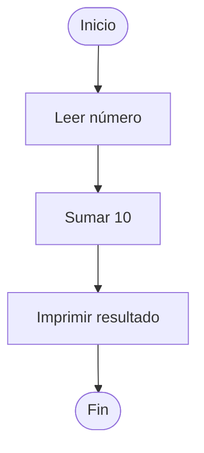
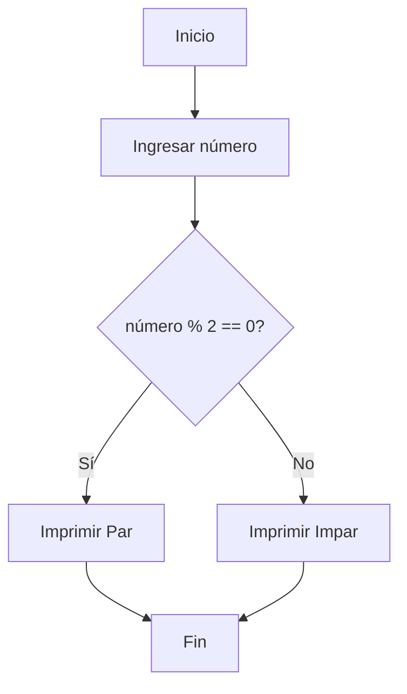
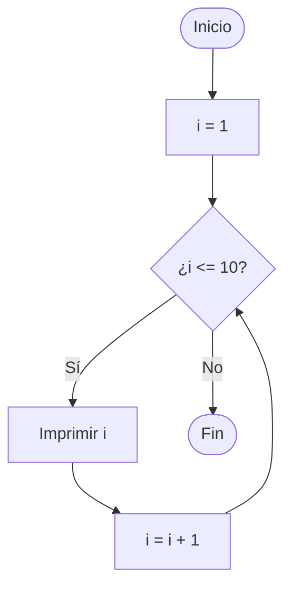
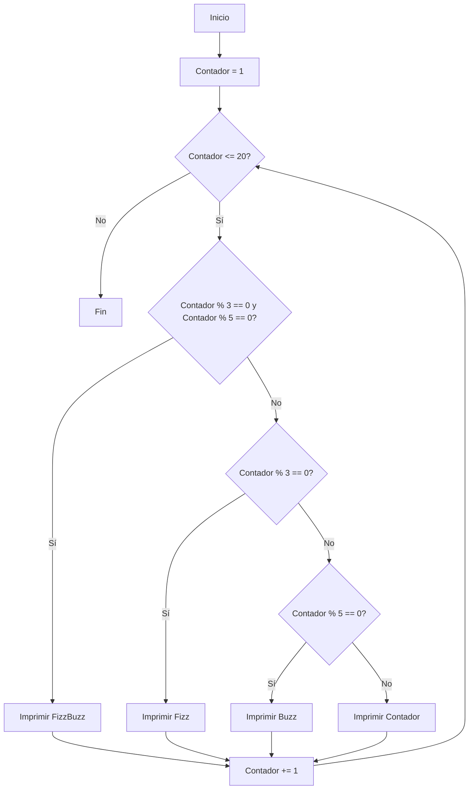

# Diagramas de flujo: guía práctica

> Guía práctica para entender qué son, qué símbolos usar, cómo escribirlos en Mermaid, y qué herramienta elegir según la situación
> 

---

### 🧩 ¿Qué es un diagrama de flujo?

Los **diagramas de flujo** son representaciones visuales de la **lógica de un programa o proceso**.

Muestran el orden de ejecución de las instrucciones y las decisiones que se toman en cada paso.

Antes de escribir código, los programadores los usan para **pensar, planificar y depurar errores lógicos**.

- Qué hace primero.
- Qué condiciones evalúa.
- Cuándo se repite algo.
- Cuándo termina.

> 💬 *En programación, los diagramas de flujo son como el mapa antes de construir la ruta.*
> 

---

## ⚙️ ¿Para qué sirven?

🔹 Entender cómo fluye la información en un programa.

🔹 Diseñar soluciones lógicas sin necesidad de código.

🔹 Explicar ideas a otras personas (comunicación visual).

🔹 Detectar errores o decisiones mal planteadas antes de codificar.

🔹 Documentar procesos o algoritmos para el futuro.

## **🧠¿Por qué usar diagramas de flujo?**

| Beneficio | Descripción |
| --- | --- |
| 🧠 **Claridad lógica** | Permite visualizar la estructura de decisiones y repeticiones antes de escribir código. |
| 🪞 **Prevención de errores** | Facilita detectar errores lógicos (no de sintaxis) de forma temprana. |
| 🧩 **Comunicación clara** | Ayuda a explicar la lógica a otros programadores o estudiantes sin usar código. |
| ⚙️ **Diseño modular** | Permite descomponer un problema en pasos más pequeños y comprensibles. |

### Símbolos básicos y su significado

> En la columna "Mermaid" verás cómo escribir el símbolo en el formato de texto de Mermaid (que Notion y muchos editores interpretan para generar el diagrama).
> 

| Símbolo | Nombre | Uso típico | Mermaid | Ejemplo |
| --- | --- | --- | --- | --- |
| Óvalo | Inicio / Fin | Indica el inicio o el fin del proceso | node[([Start])], node([End]) | start([Inicio]) --> end([Fin]) |
| Rectángulo | Proceso / Tarea | Acción o actividad | node[Proceso] | A[Validar datos] |
| Rombo | Decisión | Pregunta con salidas Sí/No u opciones | node{¿Condición?} | D{¿Es válido?} |
| Paralelogramo | Entrada/Salida | Leer o mostrar datos | node[/Entrada/] | I[/Leer archivo/] |
| Conector | Flechas | Flujo entre pasos | -->  o  -- text --> | A --> B  o  A -- Sí --> B |
| Subproceso | Proceso predefinido | Referencia a otro diagrama o rutina | node[[Subproceso]] | SP[[Pago en pasarela]] |

> Nota: La notación gráfica (óvalos, rombos) es estándar; en Mermaid se consigue el aspecto correcto con los diferentes delimitadores: [ ], ( ), { }, / /, [[ ]].
> 

## 🧭 Tipos de control de flujo

Todo programa sigue **dos mecanismos principales de control:**

| Tipo | Descripción | Ejemplo |
| --- | --- | --- |
| **Bifurcación (Decisión)** | Permite que el programa tome distintos caminos según una condición. | `if`, `elif`, `else` |
| **Bucle (Repetición)** | Hace que el programa repita pasos mientras se cumpla una condición. | `while`, `for` |

---

## **Tipos de estructuras de control representadas en diagramas**

### 🟢 **A. Secuencia**

Las instrucciones se ejecutan **una tras otra**, en orden.

---

### 🟡 **B. Decisión (Condicionales IF / ELSE)**

Permite ejecutar **diferentes caminos** según una condición.

🧠 *Ejemplo práctico: determinar si un número es par o impar.*

---

### 🔵 **C. Repetición (Bucles WHILE / FOR)**

Ejecuta un conjunto de instrucciones **mientras una condición sea verdadera**.

🧠 *Ejemplo práctico: imprimir los números del 1 al 10.*

---

### 🟣 **D. Combinación: FizzBuzz**

Ejemplo clásico que une decisiones y repeticiones.

💬 *FizzBuzz es un excelente ejemplo para entender cómo las condiciones anidadas y los bucles trabajan juntos.*

---

## 🔹 **5. Recomendaciones prácticas**

- ✏️ **Dibuja antes de codificar.** Te ayuda a planificar tu lógica.
- ⚡ **Usa herramientas visuales.** Ejemplo: [draw.io](https://draw.io/), [Excalidraw](https://excalidraw.com/), [Mermaid](https://www.mermaidchart.com/).
- 🚫 **Evita saturar tu diagrama.** Divide procesos grandes en subdiagramas.
- 🔄 **Valida el flujo.** Sigue con el dedo cada línea para verificar si todas las decisiones vuelven al camino correcto.
- 🧭 **Nombra tus variables y decisiones claramente.** Ejemplo: `contador`, `es_par`, `limite`.

---

## 🧠 **Recordatorios esenciales**

🔹 Un **organigrama** representa visualmente los pasos o decisiones dentro de un proceso o programa.

🔹 Los **símbolos principales** son: Terminal, Línea de flujo, Entrada/Salida, Proceso y Decisión.

🔹 El control de flujo utiliza **dos métodos clave**: bifurcaciones (`if/else, switch`) y bucles (`for, while`).

🔹 Las **bifurcaciones pueden combinarse con bucles**, como en el ejemplo de FizzBuzz.

🔹 Los diagramas **no detectan errores de sintaxis**, pero sí ayudan a encontrar errores lógicos.

🔹 El **rombo (decisión)** representa las ramificaciones (condiciones Verdadero/Falso).

🔹 Si un bucle no tiene incremento, se convierte en **infinito**.

🔹 El **orden de las comparaciones** en `if/elif/else` es importante: una vez que se cumple una, las siguientes se ignoran.

🔹 En Python, cualquier bucle **`for` puede escribirse como `while`**, aunque `for` es más legible para listas o rangos.

🔹 Los lenguajes cambian su **sintaxis de control de flujo**, pero la lógica subyacente siempre es la misma.

---

## 🧾 **Conclusión**

> Los diagramas de flujo son el primer paso para aprender a pensar como programador.
> 
> 
> Permiten **entender la lógica antes de escribir código**, detectar errores con anticipación y comunicar ideas de manera clara una idea en un proceso claro, estructurado y sin ambigüedades.
> 
> Dominar su lectura y diseño es el primer paso para dominar la lógica de programación.
>
