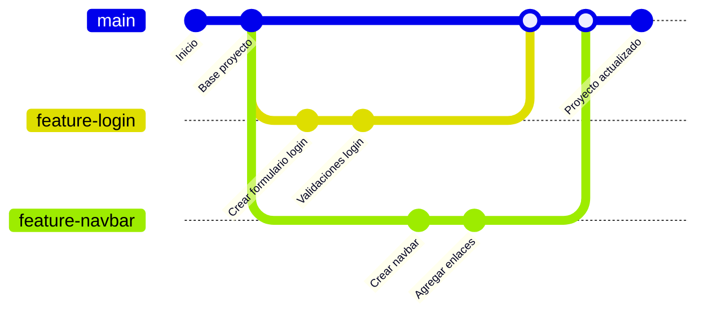
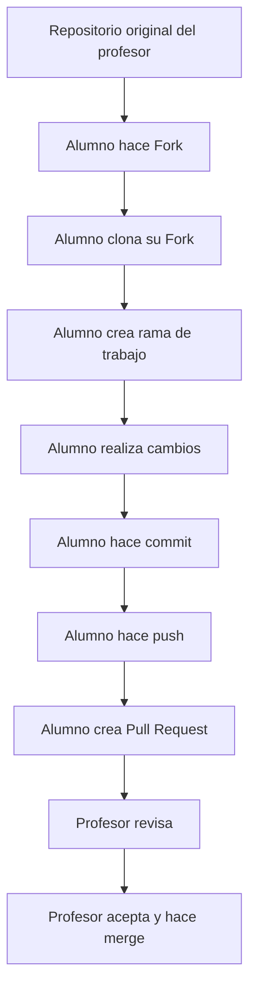

# Branching en Git

<aside>

> 🎯 **Objetivo general**
> 
> 
> Comprender qué es el **branching en Git**, por qué se utiliza en proyectos reales, cómo permite trabajar en paralelo sin dañar la rama principal, y cómo colaborar mediante **forks, ramas, commits, push y pull requests**.
> 
</aside>

---

# 1. ¿Qué significa Branching en Git?

En Git, **branching** significa trabajar con **ramas**.

Una **rama** es una línea de trabajo separada dentro de un proyecto.

Permite hacer cambios sin afectar directamente la versión principal del código.

## Idea simple

Piensa en Git como un árbol:

- el tronco principal sería `main`
- cada nueva idea o cambio puede salir como una rama nueva
- luego esa rama puede volver a unirse al tronco si el trabajo fue aprobado

---

# 2. ¿Por qué existen las ramas?

Las ramas existen para que varias personas puedan trabajar al mismo tiempo sin pisarse entre sí.

## Sin ramas

Si todos modifican `main` directamente:

- alguien puede romper el proyecto
- los cambios se mezclan sin control
- es difícil revisar quién hizo qué
- hay más riesgo de errores

## Con ramas

Cada persona puede:

- crear su propia rama
- hacer cambios aislados
- probar su trabajo
- enviar una solicitud de revisión
- unir su trabajo a `main` solo si está correcto

---

# 3. ¿Por qué el branching es importante?

El branching es importante porque:

- protege la rama principal
- permite trabajo colaborativo
- facilita revisar cambios antes de aceptarlos
- ayuda a organizar tareas
- hace posible corregir errores sin afectar la versión estable
- permite experimentar sin miedo
- deja un historial más ordenado

---

# 4. Conceptos clave que deben entender

## `main`

Es la rama principal del proyecto.

Normalmente representa la versión más estable.

## `branch`

Es una rama de trabajo separada.

## `fork`

Es una copia de un repositorio en la cuenta personal de GitHub de otra persona.

## `commit`

Es un punto guardado en la historia del proyecto.

## `push`

Envía los cambios locales al repositorio remoto.

## `pull request`

Es una solicitud para que tus cambios sean revisados e incorporados al proyecto original.

## `merge`

Es la unión de una rama con otra.

---

# 5. Diferencia entre Branch y Fork

Esto es muy importante porque muchos alumnos los confunden.

## Branch

Una rama existe **dentro del mismo repositorio**.

Ejemplo:

- repositorio: `proyecto-tienda`
- ramas:
    - `main`
    - `feature-login`
    - `feature-navbar`

## Fork

Un fork es una **copia del repositorio en otra cuenta**.

Ejemplo:

- repositorio original del profesor
- alumno hace fork a su cuenta GitHub
- trabaja desde su copia
- luego hace Pull Request al original

## Resumen rápido

- **branch** = línea de trabajo dentro del mismo repo
- **fork** = copia completa del repo en otra cuenta

---

# 6. Flujo real de trabajo con Branching

En proyectos reales, lo normal es:

1. Existe un repositorio principal
2. La rama principal suele ser `main`
3. Cada tarea nueva se trabaja en una rama distinta
4. El desarrollador hace commits en su rama
5. Luego hace push
6. Después crea un Pull Request
7. Otra persona revisa
8. Si todo está bien, se hace merge a `main`

---

# 7. Diagrama Mermaid — concepto de ramas

---

# 8. Diagrama Mermaid — flujo con fork y pull request

---

# 9. Flujo explicado paso a paso

## Escenario base

- Hay un repositorio del profesor
- Los alumnos deben colaborar
- Algunos trabajarán como dueños del repo y otros como contribuidores por fork

---

>*fuente: https://righteous-baron-17e.notion.site/Branching-en-Git-3284db47a255804ea956e5a3cc1263d6*
