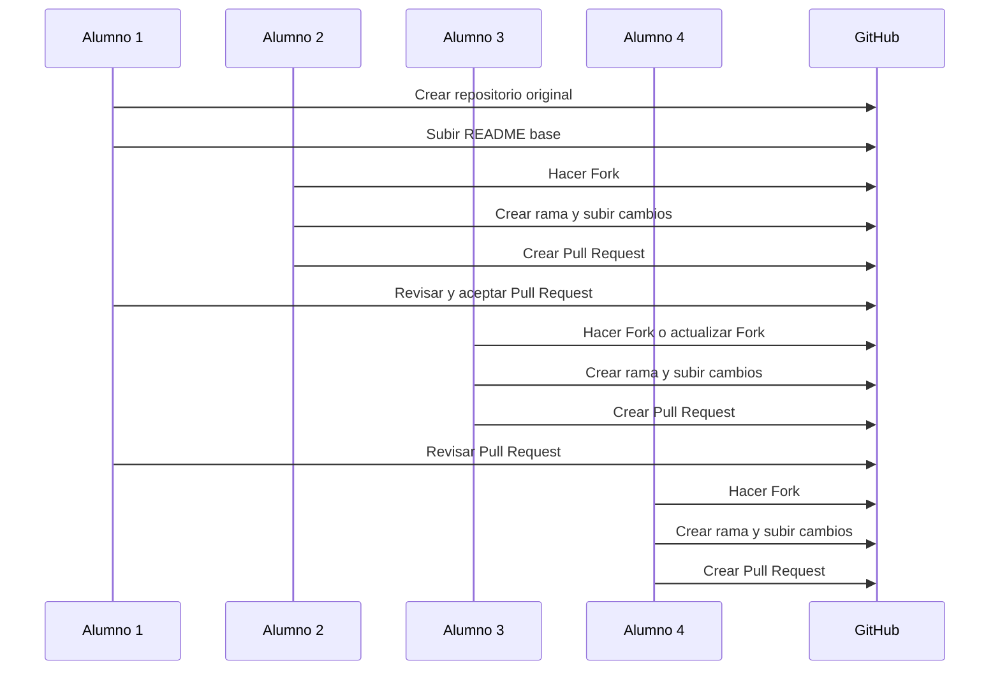

# Actividad grupal: investigación + práctica real

> [!IMPORTANT]
> Actividad en:
> https://github.com/PabloDesk/actividad-branching-git

## Objetivo de la actividad

Que los alumnos:

- investiguen qué son las ramas
- comprendan por qué se usan
- practiquen el flujo real de colaboración
- aprendan a hacer fork, branch, commit, push y pull request
- entiendan qué hace quien revisa y acepta cambios

---

# 11. Organización general para 8 alumnos

La idea es dividir la actividad en dos partes:

## Parte A — Investigación

Cada alumno investiga una pregunta distinta relacionada con branching.

## Parte B — Práctica

Cada alumno participa en una acción concreta del flujo Git/GitHub.

Así, al final:

- juntan sus respuestas
- comparan lo investigado con lo que hicieron
- construyen una visión completa del branching

---

# 12. Preguntas de investigación grupal

Cada alumno tendrá **1 tema principal**.

Luego todos juntan la información al final.

---

## 👨‍🎓 Alumno 1 — ¿Qué es una rama en Git?

### Debe investigar:

- Qué es una branch
- Para qué sirve
- Qué problema resuelve
- Por qué no se trabaja siempre en `main`

### Debe responder:

1. ¿Qué es una rama en Git?
2. ¿Por qué las ramas ayudan a ordenar el trabajo?
3. ¿Qué riesgo existe si todos trabajan en `main`?

---

## 👨‍🎓 Alumno 2 — ¿Qué diferencia hay entre branch y fork?

### Debe investigar:

- Qué es branch
- Qué es fork
- Cuándo se usa cada uno
- Por qué GitHub usa forks para contribuir a proyectos ajenos

### Debe responder:

1. ¿Qué es una branch?
2. ¿Qué es un fork?
3. ¿Cuál es la diferencia entre ambos?

---

## 👨‍🎓 Alumno 3 — ¿Qué es `main` y por qué se protege?

### Debe investigar:

- Qué representa la rama `main`
- Por qué suele ser la rama estable
- Qué significa proteger la rama principal

### Debe responder:

1. ¿Qué representa `main` en un proyecto?
2. ¿Por qué no debería usarse para cambios directos?
3. ¿Por qué es importante mantenerla estable?

---

## 👨‍🎓 Alumno 4 — ¿Qué es un commit y por qué es importante?

### Debe investigar:

- Qué es un commit
- Por qué se hacen commits pequeños
- Cómo ayuda a seguir el historial del proyecto

### Debe responder:

1. ¿Qué es un commit?
2. ¿Qué ventaja tiene hacer varios commits pequeños?
3. ¿Cómo ayudan los commits a entender la historia del trabajo?

---

## 👨‍🎓 Alumno 5 — ¿Qué es push y qué relación tiene con GitHub?

### Debe investigar:

- Qué significa trabajar local
- Qué significa remoto
- Qué hace `push`
- Por qué los cambios no aparecen en GitHub automáticamente

### Debe responder:

1. ¿Qué diferencia hay entre local y remoto?
2. ¿Qué hace `git push`?
3. ¿Por qué un commit local no siempre aparece aún en GitHub?

---

## 👨‍🎓 Alumno 6 — ¿Qué es un Pull Request?

### Debe investigar:

- Qué es un PR
- Por qué no es solo “subir código”
- Qué permite revisar antes de unir cambios

### Debe responder:

1. ¿Qué es un Pull Request?
2. ¿Para qué sirve en trabajo colaborativo?
3. ¿Por qué es importante revisar antes de hacer merge?

---

## 👨‍🎓 Alumno 7 — ¿Qué es merge y qué podría salir mal?

### Debe investigar:

- Qué significa merge
- Qué es un conflicto de merge
- Por qué ocurre cuando dos personas editan lo mismo

### Debe responder:

1. ¿Qué es un merge?
2. ¿Qué es un conflicto?
3. ¿Cómo puede evitarse o reducirse?

---

## 👨‍🎓 Alumno 8 — Buenas prácticas al trabajar con ramas

### Debe investigar:

- nombrar ramas
- frecuencia de commits
- mensajes claros
- no trabajar todo en una sola rama eterna
- revisar antes de mergear

### Debe responder:

1. ¿Cómo deberían nombrarse las ramas?
2. ¿Cómo debería escribirse un commit claro?
3. ¿Qué buenas prácticas ayudan a trabajar mejor en equipo?

---

# 13. Entrega de la investigación

Cada alumno debe entregar:

- su pregunta asignada
- definición simple
- explicación con sus palabras
- 1 ejemplo real o inventado
- 1 conclusión personal

---

# 14. Formato sugerido de entrega para cada alumno

```markdown
## Tema investigado
[Nombre del tema]

## Definición
[Explicación simple]

## Respuestas
1. ...
2. ...
3. ...

## Ejemplo
...

## Conclusión personal
...
```

---

# 15. Parte práctica: simulación real de branching con 7- 8 alumnos

Ahora viene la parte entretenida.

La idea será simular un proyecto colaborativo real con un repositorio central y varios alumnos participando.

---

# 16. Estructura de roles para los 8 alumnos

## Alumno 1

Dueño del repositorio original

## Alumno 2

Contribuidor externo 1

## Alumno 3

Contribuidor externo 2

## Alumno 4

Contribuidor externo 3

## Alumno 5

Revisor de Pull Request 1

## Alumno 6

Revisor de Pull Request 2

## Alumno 7

Apoyo en actualización de fork y nueva rama

## Alumno 8

Documentador del proceso

---

# 17. Preparación del ejercicio

## Paso 1 — Alumno 1 crea el repositorio original

Debe:

1. entrar a GitHub
2. crear un repositorio, por ejemplo: `actividad-branching-git`
3. agregar un `README.md`
4. dejarlo público
5. compartir el enlace con el grupo

---

## Paso 2 — Alumno 1 sube estructura inicial

Debe dejar algo simple como:

```markdown
# Actividad Branching Git

## Integrantes
- Alumno 1
- Alumno 2
- Alumno 3
- Alumno 4
- Alumno 5
- Alumno 6
- Alumno 7
- Alumno 8

## Objetivo
Practicar branching, fork, pull request y merge.
```

Luego hace commit y push.

---

# 18. Flujo detallado por alumno

---

## 👨‍🎓 Alumno 1 — Creador y mantenedor del repositorio

### Debe hacer:

1. Crear el repositorio original
2. Subir README inicial
3. Compartir el enlace
4. Revisar Pull Requests
5. Aceptar al menos uno
6. Explicar qué hizo como responsable del repo

### Debe aprender:

- qué es el repo original
- qué significa aceptar contribuciones
- qué hace un mantenedor

---

## 👨‍🎓 Alumno 2 — Fork, editar, subir y crear Pull Request

### Debe hacer:

1. entrar al repositorio de Alumno 1
2. hacer **Fork**
3. clonar su fork a su computador
4. crear una rama, por ejemplo `feature-aporte-alumno2`
5. modificar el README agregando su sección
6. hacer commit
7. hacer push
8. crear Pull Request al repo original

### Ejemplo de comandos

```bash
git clone URL_DEL_FORK
cd actividad-branching-git
git checkout-b feature-aporte-alumno2
```

Editar archivo.

```bash
git add .
git commit -m "feat: agregar aporte del alumno 2"
git push origin feature-aporte-alumno2
```

Después crea el Pull Request en GitHub.

---

## 👨‍🎓 Alumno 3 — Fork, actualizar si ya había hecho fork, crear rama y PR

### Debe hacer:

1. revisar si ya tenía fork del repo
2. si ya existe, actualizarlo
3. clonar o usar su copia local
4. crear rama `feature-aporte-alumno3`
5. hacer cambios
6. commit
7. push
8. Pull Request

### Si ya tenía fork

Debe investigar cómo sincronizar el fork con el original.

### Debe aprender:

- que un fork puede quedar desactualizado
- que a veces hay que sincronizar antes de trabajar

---

## 👨‍🎓 Alumno 4 — Fork y cambio en otra sección

### Debe hacer:

1. forkear
2. clonar
3. crear rama propia
4. agregar una sección nueva al README
5. commit
6. push
7. crear Pull Request

### Su aporte puede ser:

- una definición
- una conclusión
- una lista de buenas prácticas

---

## 👨‍🎓 Alumno 5 — Revisor de Pull Request

### Debe hacer:

1. abrir Pull Requests creados por compañeros
2. leer cambios
3. revisar si el nombre de rama es claro
4. revisar si el commit tiene sentido
5. dejar observaciones
6. comentar qué detectó

### Debe aprender:

- que colaborar no es solo programar
- revisar también es parte del trabajo real

---

## 👨‍🎓 Alumno 6 — Segundo revisor y apoyo en validación

### Debe hacer:

1. revisar otro PR
2. comparar con el repo original
3. verificar si hay conflictos o no
4. comentar si el cambio está listo para merge

### Debe aprender:

- cómo se valida calidad antes de aceptar cambios
- por qué revisar ayuda a evitar errores

---

## 👨‍🎓 Alumno 7 — Fork, sincronización y nueva contribución

### Debe hacer:

1. forkear
2. clonar
3. si el repo original cambió, actualizar su fork
4. crear una nueva rama
5. agregar otra contribución
6. push
7. PR

### Debe explicar:

- qué problema ocurre si el fork está atrasado
- por qué sincronizar evita conflictos

---

## 👨‍🎓 Alumno 8 — Documentador del proceso

### Debe hacer:

1. observar todos los pasos del grupo
2. tomar nota de:
    - quién creó repo
    - quién hizo fork
    - quién creó ramas
    - quién hizo PR
    - quién aceptó
3. redactar una conclusión final del proceso

### Debe construir:

- un resumen general
- una línea de tiempo
- una conclusión del equipo

---

# 19. Resultado esperado final

Al terminar la actividad, el repositorio debería tener:

- README inicial
- aportes de varios alumnos
- Pull Requests creados
- al menos uno aceptado
- evidencia de trabajo con ramas
- explicación del flujo

---

# 20. Secuencia exacta sugerida de la práctica

## Fase 1

Alumno 1 crea y sube repositorio base

## Fase 2

Alumno 2 hace fork, rama, cambio, commit, push, PR

## Fase 3

Alumno 1 revisa y acepta PR de Alumno 2

## Fase 4

Alumno 3 hace fork

Si ya tenía fork, lo actualiza

Luego crea rama, cambio, commit, push, PR

## Fase 5

Alumno 4 repite flujo con otro aporte

## Fase 6

Alumno 5 y 6 revisan los PR

## Fase 7

Alumno 7 sincroniza fork, crea nueva rama y sube aporte

## Fase 8

Alumno 8 documenta todo el proceso

---

# 21. Diagrama Mermaid — secuencia del ejercicio



---

# 22. Contenido sugerido del README colaborativo

Puedes pedir que cada alumno agregue una sección como esta:

```
## Aporte del Alumno X

### Tema investigado
...

### Lo más importante
...

### Ejemplo
...

### Conclusión
...
```

Así el archivo final queda como una construcción grupal.

---

# 23. Preguntas de reflexión final para todo el grupo

Al terminar, todos deben responder:

1. ¿Qué entendieron ahora por branching en Git?
2. ¿Qué diferencia hay entre branch y fork?
3. ¿Por qué no conviene trabajar directo en `main`?
4. ¿Qué aporta el Pull Request al trabajo en equipo?
5. ¿Qué parte del proceso les pareció más difícil?
6. ¿Qué pasaría si varias personas editan lo mismo?
7. ¿Qué buenas prácticas aplicarían en un proyecto real?
8. ¿Qué aprendieron del rol de quien revisa y acepta cambios?

---

# 24. Buenas prácticas que debes enseñarles

## Nombres de ramas claros

Ejemplos:

- `feature-login`
- `feature-readme-alumno2`
- `fix-error-navbar`

## Commits entendibles

Ejemplos:

- `feat: agregar aporte del alumno 3`
- `docs: actualizar README con investigación`
- `fix: corregir error en sección de ramas`

## No trabajar directo en `main`

Siempre mejor usar ramas.

## Hacer cambios pequeños

Más fácil de revisar y corregir.

## Revisar antes de mergear

No todo lo que sube alguien debe aceptarse sin mirar.

---

# 25. Mini glosario final

| Término | Significado |
| --- | --- |
| Repository | Carpeta del proyecto controlada por Git |
| Branch | Rama de trabajo |
| Main | Rama principal |
| Fork | Copia del repo en otra cuenta |
| Commit | Punto guardado en el historial |
| Push | Subir cambios al remoto |
| Pull Request | Solicitud para incorporar cambios |
| Merge | Unión de cambios entre ramas |

---

# 26. Cierre pedagógico

> [!TIP]
> **Trabajar con ramas no es solo aprender comandos**.
> **Es aprender a colaborar, ordenar cambios, proteger el proyecto y construir en equipo sin romper el trabajo de otros**.

---

>*fuente: https://righteous-baron-17e.notion.site/Actividad-grupal-investigaci-n-pr-ctica-real-3284db47a25580a8b323d0ece128e1b2*
