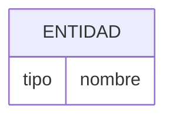
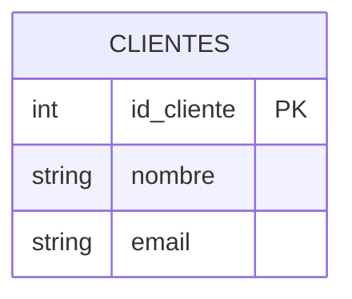
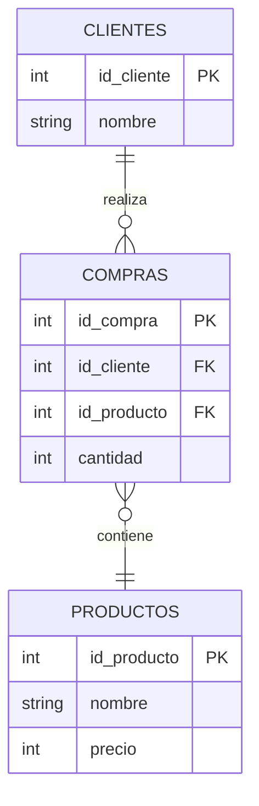
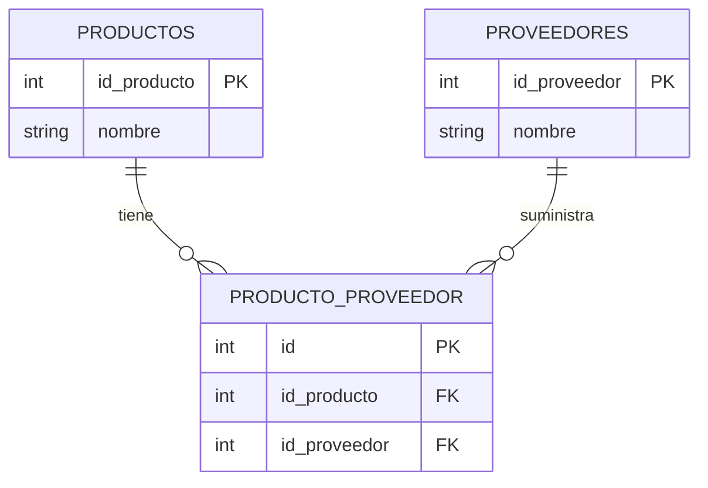
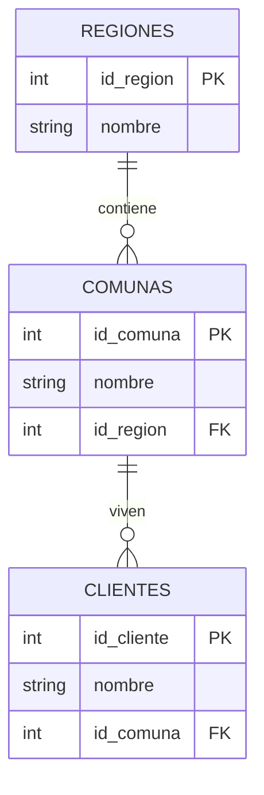

# 🧩 **Mermaid: Diagramas como código (ER incluidos)**

> [!IMPORTANT]
> [https://mermaid.live/](https://mermaid.live/)

## 🎯 **Objetivo de esta página**

Comprender:

- Qué es **Mermaid**
- Para qué sirve en desarrollo
- Cómo crear **diagramas ER (Entidad–Relación)** usando texto
- Cómo aplicarlo en modelado de bases de datos

---

## 🤔 ¿Qué es Mermaid?

**Mermaid** es una herramienta que permite crear diagramas **escribiendo código en texto plano**.

👉 En vez de dibujar con mouse (como Excalidraw o Draw.io), escribes instrucciones y el diagrama se genera automáticamente.

---

## 💡 ¿Por qué usar Mermaid?

### Ventajas clave:

- ✅ Rápido de crear
- ✅ Fácil de versionar (GitHub)
- ✅ Ideal para documentación técnica
- ✅ Evita “dibujos desordenados”
- ✅ Se integra con Notion, Markdown y README.md

---

> [!TIP]
> ## 🧠 Idea clave
> 
> Mermaid convierte texto → en diagramas visuales

---

# 🧱 Tipos de diagramas más usados

| Tipo | Uso |
| --- | --- |
| `flowchart` | Lógica de programas |
| `sequenceDiagram` | Interacción entre sistemas |
| `erDiagram` | Bases de datos (🔥 el que nos interesa) |

---

# 🧩 Diagramas ER con Mermaid

## 📌 ¿Qué es un diagrama ER?

Un diagrama ER representa:

- Entidades (tablas)
- Atributos (columnas)
- Relaciones (conexiones)

---

## 🧠 Sintaxis base



---

# 🧍 Ejemplo 1 — Tabla simple



---

## 🔍 ¿Qué significa esto?

- `CLIENTES` → tabla
- `id_cliente` → llave primaria
- `nombre`, `email` → atributos

---

# 🔗 Ejemplo 2 — Relación entre tablas



---

## 🧠 Cómo leer este diagrama

- `CLIENTES ||--o{ COMPRAS`
→ Un cliente puede tener muchas compras
- `COMPRAS }o--|| PRODUCTOS`
→ Muchas compras apuntan a un producto

---

## 💥 Traducción a lenguaje humano

> “Un cliente realiza muchas compras, y cada compra contiene un producto”
> 

---

# 🔢 Significado de los símbolos

| Símbolo | Significado |
| --- | --- |
| ` |  |
| `o{` | Muchos |
| `--` | Relación |

---

# 🏭 Ejemplo 3 — Relación muchos a muchos



---

> [!TIP]
> ## 🧠 Idea clave
> 
> Cuando hay muchos a muchos → siempre aparece una tabla intermedia


---

# 🧩 Ejemplo 4 — Atomización (nivel pro)



---

## 💡 ¿Por qué esto es importante?

Permite:

- Filtrar por región
- Crear reportes
- Evitar duplicación

---

# ⚙️ ¿Dónde usar Mermaid?

Puedes usar Mermaid en:

- Notion (bloques de código con ```mermaid)
- GitHub README.md
- Documentación técnica
- Herramientas como Obsidian, GitLab, etc.

---

# 🧪 Actividad práctica (bootcamp)

## 🧩 Caso: Sistema de Biblioteca

### 📖 Enunciado

Diseñar un diagrama ER para un sistema que permita:

- Registrar usuarios
- Registrar libros
- Registrar préstamos
- Saber qué usuario pidió qué libro
- Registrar fechas de préstamo

---

## 🎯 Lo que deben hacer

1. Crear entidades:
    - Usuarios
    - Libros
    - Préstamos
2. Definir atributos
3. Crear relaciones
4. Representarlo en Mermaid

---

## 🚀 Bonus

Agregar:

- Editorial
- Categorías de libros

---

# 🧠 Buenas prácticas

✔ Usar nombres claros

✔ Separar entidades correctamente

✔ Usar FK para relaciones

✔ No duplicar información

---

# ❌ Errores comunes

❌ Meter todo en una sola tabla

❌ No usar tabla intermedia

❌ Confundir atributos con entidades

❌ No definir PK

---

# 🏁 Cierre

> Mermaid no es solo una herramienta

Es una forma de:

- Pensar sistemas
- Diseñar bases de datos
- Documentar como profesional

---

>*fuente: https://righteous-baron-17e.notion.site/Mermaid-Diagramas-como-c-digo-ER-incluidos-3494db47a2558068b636ffb80b6d0e94*
