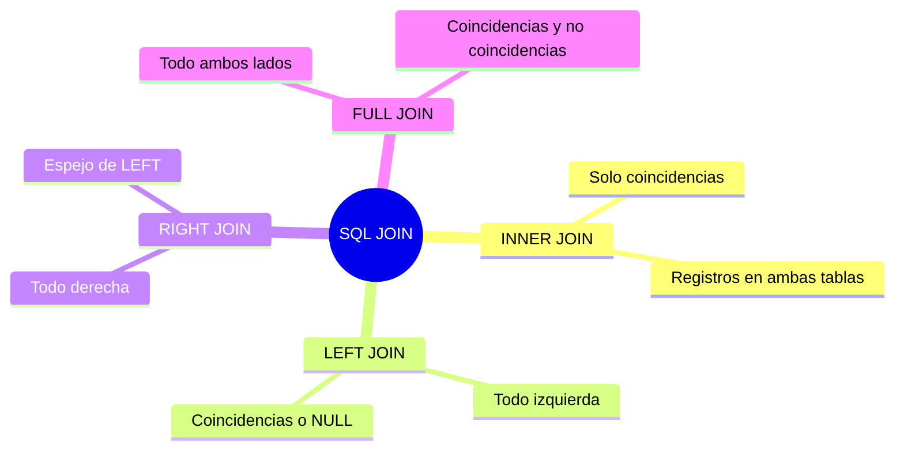
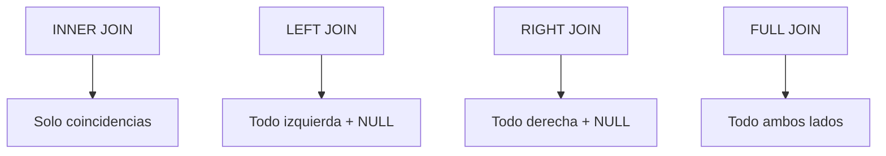
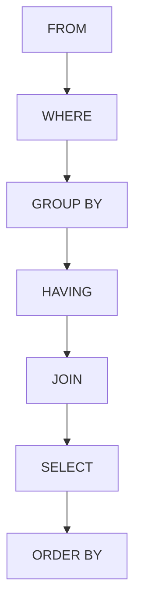
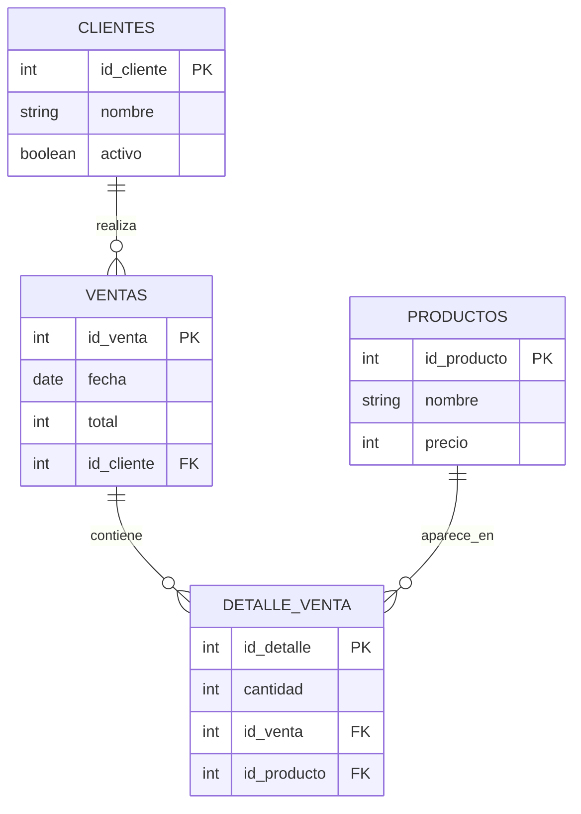
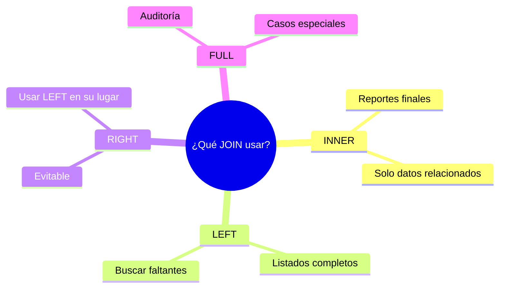

# SQL JOIN

> [!NOTE]
> **INNER · LEFT · RIGHT · FULL**

## 🎯 Objetivo de esta página

Comprender **qué son los JOIN**, **cómo funcionan**, **qué información devuelven** y **cuándo usar cada tipo**, apoyándose en **diagramas conceptuales** y **ejemplos prácticos**.

---

## 🧠 ¿Qué es un JOIN?

Un **JOIN** permite **unir filas de dos o más tablas** utilizando una **relación lógica** entre ellas.

Normalmente esa relación se basa en:

- Una **PK** (llave primaria)
- Una **FK** (llave foránea)

> 📌 JOIN no crea datos nuevos, solo cruza información existente.
> 

---

## 🧠 Mapa mental general de JOIN



---

## 🧩 Mini modelo de datos (ejemplo base)

### Tabla `clientes`

| id_cliente | nombre |
| --- | --- |
| 1 | Ana |
| 2 | Juan |
| 3 | Pedro |

---

### Tabla `ventas`

| id_venta | id_cliente | total |
| --- | --- | --- |
| 101 | 1 | 100 |
| 102 | 1 | 200 |
| 103 | 2 | 150 |

📌 Observación:

Pedro (**id_cliente = 3**) **no tiene ventas**.

---

## 🔹 INNER JOIN — *Solo coincidencias*

### ¿Qué hace?

Devuelve **solo los registros que existen en ambas tablas**.

---

### 🧠 Diagrama mental


---

### Ejemplo SQL

```sql
SELECT c.nombre, v.total
FROM clientes c
INNER JOIN ventas v
  ON c.id_cliente = v.id_cliente;

```

---

### Resultado

| nombre | total |
| --- | --- |
| Ana | 100 |
| Ana | 200 |
| Juan | 150 |

🚫 Pedro no aparece porque **no tiene registros relacionados**.

---

### Cuándo usar INNER JOIN

- Reportes finales
- Datos confirmados
- Información de negocio real

---

## 🔸 LEFT JOIN — *Todo desde la izquierda*

### ¿Qué hace?

Devuelve:

- Todos los registros de la tabla izquierda
- Aunque no tengan coincidencia en la derecha

---

### 🧠 Diagrama mental


---

### Ejemplo SQL

```sql
SELECT c.nombre, v.total
FROM clientes c
LEFT JOIN ventas v
  ON c.id_cliente = v.id_cliente;

```

---

### Resultado

| nombre | total |
| --- | --- |
| Ana | 100 |
| Ana | 200 |
| Juan | 150 |
| Pedro | NULL |

📌 `NULL` indica **ausencia de relación**, no error.

---

### Cuándo usar LEFT JOIN

- Listados completos
- Usuarios sin actividad
- Auditorías
- Búsqueda de faltantes

---

## 🔹 RIGHT JOIN — *Todo desde la derecha*

### ¿Qué hace?

Devuelve todos los registros de la tabla derecha.

---

### 🧠 Diagrama mental


---

### Ejemplo SQL

```sql
SELECT c.nombre, v.total
FROM clientes c
RIGHT JOIN ventas v
  ON c.id_cliente = v.id_cliente;
```

📌 En este ejemplo, el resultado es igual al INNER JOIN

porque todas las ventas tienen cliente.

---

### Nota importante

- RIGHT JOIN **existe** en MySQL y PostgreSQL
- No es necesario usarlo
- Todo RIGHT JOIN puede reescribirse como LEFT JOIN

👉 **Buena práctica**: usar siempre LEFT JOIN.

---

## 🔵 FULL JOIN — *Todo de ambos lados*

### ¿Qué hace?

Devuelve:

- Todos los registros de ambas tablas
- Coincidan o no

---

### 🧠 Diagrama mental


---

### Ejemplo SQL (PostgreSQL)

```sql
SELECT c.nombre, v.total
FROM clientes c
FULL JOIN ventas v
  ON c.id_cliente = v.id_cliente;

```

---

### FULL JOIN en MySQL (simulación)

```sql
SELECT c.nombre, v.total
FROM clientes c
LEFT JOIN ventas v
  ON c.id_cliente = v.id_cliente

UNION

SELECT c.nombre, v.total
FROM clientes c
RIGHT JOIN ventas v
  ON c.id_cliente = v.id_cliente;

```

---

### Cuándo usar FULL JOIN

- Auditorías
- Detección de inconsistencias
- Casos avanzados

---

## 🧠 Comparación rápida



---

## 🧠 JOIN y el flujo completo de SQL



---

## 🧠 Modelo relacional completo (contexto real)



---

## 🧠 Cuándo usar cada JOIN (criterio final)



---

## 🧠 Idea clave para cerrar

> JOIN no es magia.
> 
> 
> JOIN solo muestra las relaciones que **ya existen en el modelo**.
> 

Si el modelo está bien:

- JOIN es simple
- los resultados son claros
- los errores se detectan rápido

- 🧪 Ejercicio SQL — Demostración de JOIN
    
    ## 🎯 Objetivo
    
    Entender **qué registros aparecen** y **por qué** al usar cada tipo de JOIN.
    
    ---
    
    # 🐬 SCRIPT COMPLETO — MySQL 8
    
    ## 1️⃣ Crear base de datos
    
    ```sql
    CREATE DATABASE IF NOT EXISTS joins_sql;
    USE joins_sql;
    ```
    
    ---
    
    ## 2️⃣ Tabla clientes
    
    ```sql
    CREATE TABLE clientes (
        id_cliente INT PRIMARY KEY AUTO_INCREMENT,
        nombre VARCHAR(100) NOT NULL
    );
    ```
    
    ---
    
    ## 3️⃣ Tabla ventas
    
    ```sql
    CREATE TABLE ventas (
        id_venta INT PRIMARY KEY AUTO_INCREMENT,
        id_cliente INT,
        total INT NOT NULL,
        FOREIGN KEY (id_cliente) REFERENCES clientes(id_cliente)
    );
    ```
    
    ---
    
    ## 4️⃣ Insertar clientes
    
    ```sql
    INSERT INTO clientes (nombre) VALUES
    ('Ana'),
    ('Juan'),
    ('Pedro'),
    ('María');
    ```
    
    ---
    
    ## 5️⃣ Insertar ventas
    
    ```sql
    INSERT INTO ventas (id_cliente, total) VALUES
    (1, 100),
    (1, 200),
    (2, 150),
    (NULL, 300);
    ```
    
    📌 Observaciones importantes:
    
    - Pedro (**id_cliente = 3**) **no tiene ventas**
    - Existe una venta **sin cliente asociado**
    
    ---
    
    # 🔍 CONSULTAS JOIN — MySQL
    
    ---
    
    ## 🔹 INNER JOIN
    
    **Solo coincidencias**
    
    ```sql
    SELECT c.nombre, v.total
    FROM clientes c
    INNER JOIN ventas v
      ON c.id_cliente = v.id_cliente;
    ```
    
    ### Resultado esperado
    
    - Ana (2 ventas)
    - Juan (1 venta)
    - Pedro ❌
    - Venta sin cliente ❌
    
    ---
    
    ## 🔸 LEFT JOIN
    
    **Todos los clientes**
    
    ```sql
    SELECT c.nombre, v.total
    FROM clientes c
    LEFT JOIN ventas v
      ON c.id_cliente = v.id_cliente;
    ```
    
    ### Resultado esperado
    
    - Ana (ventas)
    - Juan (ventas)
    - Pedro → `NULL`
    - María → `NULL`
    
    ---
    
    ## 🔹 RIGHT JOIN
    
    **Todas las ventas**
    
    ```sql
    SELECT c.nombre, v.total
    FROM clientes c
    RIGHT JOIN ventas v
      ON c.id_cliente = v.id_cliente;
    ```
    
    ### Resultado esperado
    
    - Ventas de Ana
    - Ventas de Juan
    - Venta sin cliente → `NULL`
    
    ---
    
    ## 🔵 FULL JOIN (simulado en MySQL)
    
    ```sql
    SELECT c.nombre, v.total
    FROM clientes c
    LEFT JOIN ventas v
      ON c.id_cliente = v.id_cliente
    
    UNION
    
    SELECT c.nombre, v.total
    FROM clientes c
    RIGHT JOIN ventas v
      ON c.id_cliente = v.id_cliente;
    ```
    
    ### Resultado esperado
    
    - Todos los clientes
    - Todas las ventas
    - Incluye registros sin relación en ambos lados
    
    ---
    
    # 🐘 SCRIPT COMPLETO — PostgreSQL 16
    
    ## 1️⃣ Crear base de datos
    
    ```sql
    CREATE DATABASE joins_sql;
    ```
    
    > Conectarse a joins_sql
    > 
    
    ---
    
    ## 2️⃣ Tabla clientes
    
    ```sql
    CREATE TABLE clientes (
        id_cliente INT GENERATED ALWAYS AS IDENTITY PRIMARY KEY,
        nombre VARCHAR(100) NOT NULL
    );
    ```
    
    ---
    
    ## 3️⃣ Tabla ventas
    
    ```sql
    CREATE TABLE ventas (
        id_venta INT GENERATED ALWAYS AS IDENTITY PRIMARY KEY,
        id_cliente INT,
        total INT NOT NULL,
        FOREIGN KEY (id_cliente) REFERENCES clientes(id_cliente)
    );
    ```
    
    ---
    
    ## 4️⃣ Insertar clientes
    
    ```sql
    INSERT INTO clientes (nombre) VALUES
    ('Ana'),
    ('Juan'),
    ('Pedro'),
    ('María');
    ```
    
    ---
    
    ## 5️⃣ Insertar ventas
    
    ```sql
    INSERT INTO ventas (id_cliente, total) VALUES
    (1, 100),
    (1, 200),
    (2, 150),
    (NULL, 300);
    ```
    
    ---
    
    # 🔍 CONSULTAS JOIN — PostgreSQL
    
    ---
    
    ## 🔹 INNER JOIN
    
    ```sql
    SELECT c.nombre, v.total
    FROM clientes c
    INNER JOIN ventas v
      ON c.id_cliente = v.id_cliente;
    ```
    
    ---
    
    ## 🔸 LEFT JOIN
    
    ```sql
    SELECT c.nombre, v.total
    FROM clientes c
    LEFT JOIN ventas v
      ON c.id_cliente = v.id_cliente;
    ```
    
    ---
    
    ## 🔹 RIGHT JOIN
    
    ```sql
    SELECT c.nombre, v.total
    FROM clientes c
    RIGHT JOIN ventas v
      ON c.id_cliente = v.id_cliente;
    ```
    
    ---
    
    ## 🔵 FULL JOIN (nativo en PostgreSQL)
    
    ```sql
    SELECT c.nombre, v.total
    FROM clientes c
    FULL JOIN ventas v
      ON c.id_cliente = v.id_cliente;
    ```
    
    ---
    
    # 🧠 Reflexión
    
    - `INNER JOIN` → **solo lo que coincide**
    - `LEFT JOIN` → **todos los clientes**
    - `RIGHT JOIN` → **todas las ventas**
    - `FULL JOIN` → **todo, coincida o no**
    - `NULL` **no es error**, es información
    - El resultado depende **del tipo de JOIN**, no del SQL “bien o mal”

---

>*fuente: https://righteous-baron-17e.notion.site/SQL-JOIN-3414db47a255808aa63dde5825409798*

