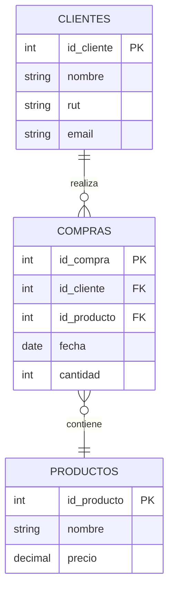
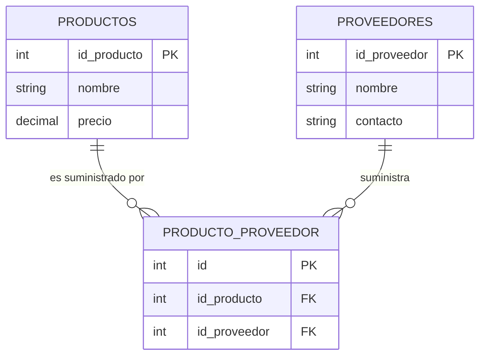
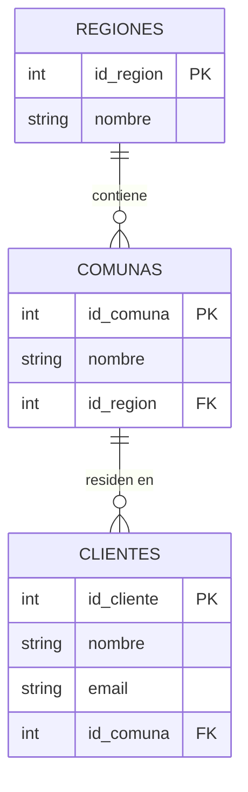

# Relaciones entre tablas en SQL

> [!NOTE]
> *PK, FK, autoincremento y visión completa del modelo*

## 🎯 Objetivo de esta página

Comprender **cómo se relacionan las tablas entre sí**, usando **llaves primarias (PK)**, **llaves foráneas (FK)** y **IDs autoincrementales**, y visualizar el modelo completo antes de comenzar con `JOIN`.

---

## 🧩 Recordatorio clave

- Una **tabla** representa una **entidad**
- Una **PK** identifica de forma única cada registro
- Una **FK** referencia a otra tabla
- Las relaciones **no mezclan datos**, solo conectan entidades

---

## 🔢 IDs autoincrementales (forma real de trabajar)

En sistemas reales, los IDs se generan automáticamente.

### 🐬 MySQL

```sql
id_cliente INT PRIMARY KEY AUTO_INCREMENT
```

### 🐘 PostgreSQL

```sql
id_cliente INT GENERATED ALWAYS AS IDENTITY PRIMARY KEY
```

A partir de ahora, **todas las tablas usarán este enfoque**.

---

## 🧍 Entidad: Clientes

### Crear tabla `clientes`

**MySQL**

```sql
CREATE TABLE clientes (
    id_cliente INT PRIMARY KEY AUTO_INCREMENT,
    nombre VARCHAR(100),
    rut VARCHAR(15),
    email VARCHAR(100)
);
```

**PostgreSQL**

```sql
CREATE TABLE clientes (
    id_cliente INT GENERATED ALWAYS AS IDENTITY PRIMARY KEY,
    nombre VARCHAR(100),
    rut VARCHAR(15),
    email VARCHAR(100)
);
```

---

## 📦 Entidad: Productos

### Crear tabla `productos`

**MySQL**

```sql
CREATE TABLE productos (
    id_producto INT PRIMARY KEY AUTO_INCREMENT,
    nombre VARCHAR(100),
    precio INT
);
```

**PostgreSQL**

```sql
CREATE TABLE productos (
    id_producto INT GENERATED ALWAYS AS IDENTITY PRIMARY KEY,
    nombre VARCHAR(100),
    precio INT
);
```

---

## 🧾 Relación Cliente ↔ Producto

*(Muchos a muchos)*

Un cliente puede comprar muchos productos

Un producto puede ser comprado por muchos clientes

Esto se representa con una **tabla intermedia**.

---

## 🛒 Tabla `compras` (con FK)

### Crear tabla `compras`

**MySQL**

```sql
CREATE TABLE compras (
    id_compra INT PRIMARY KEY AUTO_INCREMENT,
    id_cliente INT,
    id_producto INT,
    fecha DATE,
    cantidad INT,
    FOREIGN KEY (id_cliente) REFERENCES clientes(id_cliente),
    FOREIGN KEY (id_producto) REFERENCES productos(id_producto)
);

```

**PostgreSQL**

```sql
CREATE TABLE compras (
    id_compra INT GENERATED ALWAYS AS IDENTITY PRIMARY KEY,
    id_cliente INT,
    id_producto INT,
    fecha DATE,
    cantidad INT,
    CONSTRAINT fk_cliente
        FOREIGN KEY (id_cliente) REFERENCES clientes(id_cliente),
    CONSTRAINT fk_producto
        FOREIGN KEY (id_producto) REFERENCES productos(id_producto)
);

```

---

## 🔍 Cómo se ven los datos ahora

```sql
SELECT * FROM compras;
```

Ejemplo de resultado:

| id_compra | id_cliente | id_producto | fecha | cantidad |
| --- | --- | --- | --- | --- |
| 1 | 1 | 2 | 2024-09-01 | 2 |

Esto significa:

- Cliente **1**
- Compró producto **2**
- En una fecha específica

---

## 🧠 Diagrama conceptual (modelo relacional)



📌 Este es el **corazón del modelo relacional**.

---

## 🏭 Entidad: Proveedores

### Crear tabla `proveedores`

**MySQL**

```sql
CREATE TABLE proveedores (
    id_proveedor INT PRIMARY KEY AUTO_INCREMENT,
    nombre VARCHAR(100),
    contacto VARCHAR(100)
);
```

**PostgreSQL**

```sql
CREATE TABLE proveedores (
    id_proveedor INT GENERATED ALWAYS AS IDENTITY PRIMARY KEY,
    nombre VARCHAR(100),
    contacto VARCHAR(100)
);
```

---

## 🔗 Relación Producto ↔ Proveedor

*(Muchos a muchos)*

---

## 🧩 Tabla `producto_proveedor`

**MySQL**

```sql
CREATE TABLE producto_proveedor (
    id INT PRIMARY KEY AUTO_INCREMENT,
    id_producto INT,
    id_proveedor INT,
    FOREIGN KEY (id_producto) REFERENCES productos(id_producto),
    FOREIGN KEY (id_proveedor) REFERENCES proveedores(id_proveedor)
);
```

**PostgreSQL**

```sql
CREATE TABLE producto_proveedor (
    id INT GENERATED ALWAYS AS IDENTITY PRIMARY KEY,
    id_producto INT,
    id_proveedor INT,
    FOREIGN KEY (id_producto) REFERENCES productos(id_producto),
    FOREIGN KEY (id_proveedor) REFERENCES proveedores(id_proveedor)
);
```

---

## 🧠 Diagrama producto – proveedor



---

## 📍 Dirección y atomización (visión completa)

### Opción simple

```sql
direccion VARCHAR(200)

```

✔ Válida

✔ Simple

---

### Opción atomizada



Esta estructura se usa cuando:

- Se filtra por comuna o región
- Se generan reportes
- Se reutiliza información

---

## 🧠 Qué deja clara esta página

- Las relaciones se construyen con **PK y FK**
- Los IDs autoincrementales **no cambian el modelo**
- Las tablas intermedias son normales y necesarias
- SQL separa datos para mantener consistencia
- Los diagramas ayudan a entender antes de escribir consultas

---

>*fuente: https://righteous-baron-17e.notion.site/Relaciones-entre-tablas-en-SQL-3414db47a25580fbb8bdf96e8e27e142*

